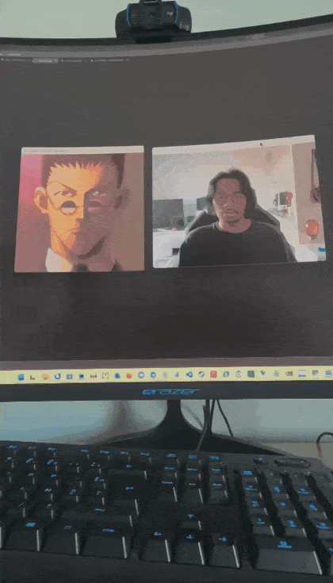

# 👐 Hunter × Hunter Gesture AI

A real-time hand gesture recognition project inspired by **Hunter × Hunter**.

The application uses a webcam to detect one or two hands, recognize predefined gestures with a machine-learning model, and display a corresponding Hunter × Hunter character image.

The project was built as a hands-on exploration of **Computer Vision, feature engineering and Machine Learning**, with the goal of understanding the complete pipeline rather than relying on an end-to-end black-box solution.

---

## 🎬 Demo



The application runs two windows:

* 📷 **Webcam** — live camera feed with hand landmarks and articulations
* 🎴 **Character** — corresponding Hunter × Hunter character image

When no hand is detected, a default image is displayed.

---

## ✨ Features

* Real-time webcam capture with OpenCV
* Hand detection using MediaPipe
* Support for **up to two hands**
* 21 landmarks detected per hand
* 126 normalized features
* Custom dataset collected from webcam
* Random Forest gesture classifier
* Real-time gesture prediction
* Confidence estimation
* Hunter × Hunter character mapping
* Special `no_hand` state
* Git-based version history

---

## 🧠 Recognized Gestures

The current model recognizes 8 gestures:

| Gesture              | Description                       |
| -------------------- | --------------------------------- |
| `fist`               | Closed fist                       |
| `open_hand`          | Open hand                         |
| `v_sign`             | V sign                            |
| `pray_one_hand`      | Prayer-like hand position         |
| `heart_two_hand`     | Heart gesture using two hands     |
| `open_hand_pointing` | Open hand pointing                |
| `killua_hand`        | Killua-inspired hand pose         |
| `kuroro_bouche`      | Hand placed in front of the mouth |

In addition, the application detects when **no hand is visible** and displays a dedicated image.

---

## 🏗️ Architecture

```text
                    Webcam
                       │
                       ▼
                 OpenCV Capture
                       │
                       ▼
               MediaPipe Hand
                  Detection
                       │
              ┌────────┴────────┐
              │                 │
           1 hand             2 hands
              │                 │
              └────────┬────────┘
                       ▼
              Landmark Extraction
                       │
                       ▼
              Feature Normalization
                       │
                       ▼
                 126 Features
                       │
                       ▼
              Random Forest Model
                       │
                       ▼
               Gesture Prediction
                       │
              ┌────────┴────────┐
              │                 │
          Recognized          No hand
            gesture           detected
              │                 │
              ▼                 ▼
       Character Mapping     no_hand
              │                 │
              └────────┬────────┘
                       ▼
                Character Image
```

---

## 🔬 Computer Vision

MediaPipe detects **21 landmarks per hand**.

Each landmark contains:

* `x`
* `y`
* `z`

This gives:

```text
21 × 3 = 63 features per hand
```

Because the application supports two hands:

```text
63 × 2 = 126 features
```

When only one hand is detected, the second set of 63 features is filled with zeros.

### Feature normalization

The landmarks are transformed so that the wrist becomes the origin.

This makes the representation less dependent on the position of the hand in the image.

The features are then normalized according to the maximum distance from the wrist, reducing the influence of the hand's scale and distance from the camera.

---

## 🤖 Machine Learning

The classifier is a **Random Forest** implemented with scikit-learn.

### Dataset

The final dataset contains:

* **4,595 samples**
* **8 classes**
* **126 features per sample**
* **0 missing values**

Class distribution:

| Class                | Samples |
| -------------------- | ------: |
| `open_hand_pointing` |     616 |
| `open_hand`          |     589 |
| `pray_one_hand`      |     586 |
| `heart_two_hand`     |     580 |
| `killua_hand`        |     565 |
| `v_sign`             |     558 |
| `fist`               |     553 |
| `kuroro_bouche`      |     548 |

The dataset was collected manually using the project's webcam data collection script.

---

## 📊 Model Performance

The final model was evaluated using an 80/20 stratified train/test split.

```text
Training samples: 3676
Test samples:      919

Accuracy: 99.56%
```

The model produced only **5 classification errors out of 919 test samples**.

### Classification results

| Gesture            | Precision | Recall |   F1 |
| ------------------ | --------: | -----: | ---: |
| fist               |      0.99 |   0.99 | 0.99 |
| heart_two_hand     |      0.99 |   1.00 | 1.00 |
| killua_hand        |      1.00 |   0.98 | 0.99 |
| kuroro_bouche      |      1.00 |   1.00 | 1.00 |
| open_hand          |      1.00 |   1.00 | 1.00 |
| open_hand_pointing |      0.99 |   0.99 | 0.99 |
| pray_one_hand      |      1.00 |   1.00 | 1.00 |
| v_sign             |      0.99 |   1.00 | 1.00 |

> Note: this evaluation uses a random train/test split from the same collected dataset. It demonstrates strong performance on this dataset, but it does not guarantee identical performance with different users, webcams, lighting conditions or backgrounds.

---

## 📁 Project Structure

```text
hunter-x-hunter-gesture-ai/
│
├── assets/
│   └── characters/
│       └── *.png
│
├── data/
│   ├── gestures.csv
│   └── gestures_v3.csv
│
├── models/
│   ├── hand_landmarker.task
│   └── gesture_classifier_v4.pkl
│
├── app.py
├── character_mapping.py
├── collect_data.py
├── features.py
├── hand_tracking.py
├── predict.py
├── train_model.py
├── requirements.txt
└── README.md
```

Character images are intentionally excluded from the public repository.

---

## ⚙️ Installation

### Requirements

* Python 3.12
* Webcam
* Windows / Linux / macOS
* Git

### Clone the repository

```bash
git clone https://github.com/m0s0l0k/hunter-x-hunter-gesture-ai.git
cd hunter-x-hunter-gesture-ai
```

### Create a virtual environment

```bash
python -m venv .venv
```

Activate it on Windows:

```powershell
.\.venv\Scripts\Activate.ps1
```

### Install dependencies

```bash
pip install -r requirements.txt
```

---

## 📦 MediaPipe Model

The project requires the MediaPipe Hand Landmarker model:

```text
models/hand_landmarker.task
```

Place the model file in the `models/` directory before running the application.

---

## ▶️ Usage

### Run gesture recognition

```bash
python predict.py
```

The application opens:

1. A webcam window with the detected hand landmarks.
2. A character window displaying the mapped Hunter × Hunter image.

Press:

```text
Q
```

to exit.

---

## 🧪 Collecting Data

New gestures can be added using:

```bash
python collect_data.py
```

The script allows samples to be collected for each gesture using keyboard shortcuts.

The collected landmarks are stored in:

```text
data/gestures_v3.csv
```

---

## 🏋️ Training the Model

After collecting new data:

```bash
python train_model.py
```

The trained model is saved as:

```text
models/gesture_classifier_v4.pkl
```

---

## 🧭 Project Evolution

The project was developed incrementally.

### V1 — Webcam

Initial webcam capture using OpenCV.

### V2 — Gesture Recognition

Added:

* MediaPipe hand tracking
* Landmark extraction
* Feature normalization
* Random Forest classification
* Initial gesture dataset

### V3 — Multi-hand Recognition

Extended the feature representation from:

```text
63 → 126 features
```

This enabled gestures involving two hands, including the heart gesture.

### V4 — Hunter × Hunter Integration

Added:

* 8 gesture classes
* Character mapping
* Real-time character display
* `no_hand` state
* Hand articulation visualization

Final accuracy:

**99.56%**

---

## 🛠️ Technologies

* **Python**
* **OpenCV**
* **MediaPipe**
* **NumPy**
* **Pandas**
* **scikit-learn**
* **Joblib**
* **Git / GitHub**

---

## 📚 What I Learned

This project allowed me to experiment with the complete machine-learning pipeline:

* Capturing real-world data
* Building a custom dataset
* Landmark-based computer vision
* Feature engineering
* Feature normalization
* Multi-hand representation
* Supervised classification
* Train/test evaluation
* Confusion matrices
* Real-time inference
* Model persistence
* Git version control

The main goal was not simply to achieve a high accuracy score, but to understand how each component of the pipeline affects the final result.

---

## 🚧 Limitations

The current model was trained using data collected from a single setup.

Performance may therefore vary depending on:

* Lighting
* Camera quality
* Background
* Hand size
* Distance from the webcam
* Hand orientation
* Different users

The current feature representation also focuses primarily on individual hand shapes. More complex gestures involving the spatial relationship between two hands could benefit from additional features describing the relative position and orientation of the hands.

---

## 🚀 Possible Future Improvements

Possible directions for a future version:

* Temporal smoothing of predictions
* Confidence thresholds
* More robust multi-user training data
* Additional gestures
* Relative-position features between hands
* Animated character transitions
* A graphical user interface
* Model comparison with other classifiers
* Deep-learning-based gesture recognition
* Deployment as a standalone application

---

## ⚖️ Disclaimer

This project is a personal fan project inspired by **Hunter × Hunter**.

Character artwork is used locally for demonstration purposes and is not included in the public repository.

All rights to the Hunter × Hunter characters and related artwork belong to their respective copyright holders.

---

## 👤 Author

**m0s0l0k**

GitHub:
https://github.com/m0s0l0k

---

⭐ If you find the project interesting, feel free to explore the code and the different development stages.
